## https://simulator.atterwind.info
# Apparent Wind Sail-Trim Simulator 
This simulator trims an [A-Class catamaran](https://www.a-cat.org/) to best fit calculated apparent wind. While this is an idealization, it comes close enough to get a better understanding of sail-trim. Basic sail-twist concepts apply to all other catamarans like [Nacra 15](https://nacrasailing.com/our-boats/daggerboard-boats/nacra-15/) or [Nacra 17](https://nacra17.org/) as well as dinghys such as [Laser](http://www.laserinternational.org/) or [RS Aero](https://en.wikipedia.org/wiki/RS_Aero) too, just ignore lack of jib of the former and mast rotation, traveller on the latter. 
* learn and understand true-wind vs. __apparent wind__ and it's impact to __sail-twist__ and trim
* improve __sail-trim__ on the water with better understanding of how much sail-twist, mast-rotation and traveler move is needed in certain situations
* __share simulator views__ as URL hyperlinks with others, as baseline to discuss real-world trim improvements


Quick intro on how to use this simulator:
1. __adjust true-wind speed__ in knots. it's direction is irrelevant for the simulation.
1. __adjust wind condition__, stable thermal winds have higher wind gradient impact than gusty unstable winds
1. __adjust boat heading__ in degrees relative to true-wind direction - e.g. 50° for upwind, and 135° for downwind. 
1. __adjust boat speed__ in knots that you estimate to fit to wind and heading. The simulated foiling A-Cat will fly at 13+ knots. Because it's a simulator, have also fun sailing practically impossible configurations.
1. click _share current view_ to __bookmark__ your current view or __share__ it as Web link with others

# Basics
## Wind Speed Gradient 
Surface friction causes the wind speed to be close to zero at the surface, meaning that the air molecules are slowed down by the water surface. Slow air molecules also slow down the air above them and so forth. This causes a gradient of wind speeds, also called wind shear. This simulation calculates the wind gradient based on this [wind turbine research][wikipediagradient]. Results are similar to studies by Frank Bethwaite's High Performance Sailing. When looking at the three screenshots below, you see on each on the left the true-wind-field. The cone points into the direction of wind flow and represents wind-speed by it's length. You will notice that the biggest wind speed gradient impact is in the lower third 0-3m range of the ~10m high boat. The leftmost configuration shows stable winds, which have highest wind sheer and the right most unstable gusty wind conditions. Those conditions are specified in the formula by the _Hellman_ constant _a_. The apparent wind is visualized in front of the mast of the catamaran. However, as in this configuration the boat is not moving, the apparent wind gradient equals the true wind gradient. 

[stable]: https://simulator.atterwind.info/?bh=103&bs=0&ws=25&wh=0.27&ch=5.5&cs=-21.7&cl=10.2&cry=13.7&crz=179.4&crx=-177.6&cth=4.5&cts=2.8&ctl=4.3&csh=0 (view in simulator)
[neutral]: https://simulator.atterwind.info/?bh=103&bs=0&ws=25&wh=0.1&ch=5.5&cs=-21.7&cl=10.2&cry=13.7&crz=179.4&crx=-177.6&cth=4.5&cts=2.8&ctl=4.3&csh=0 (view in simulator)
[unstable]: https://simulator.atterwind.info/?bh=103&bs=0&ws=25&wh=0.06&ch=5.5&cs=-21.7&cl=10.2&cry=13.7&crz=179.4&crx=-177.6&cth=4.5&cts=2.8&ctl=4.3&csh=0 (view in simulator)

| [stable][stable] | [neutral][neutral] | [unstable][unstable] |
|:---:|:---:|:---:|
| [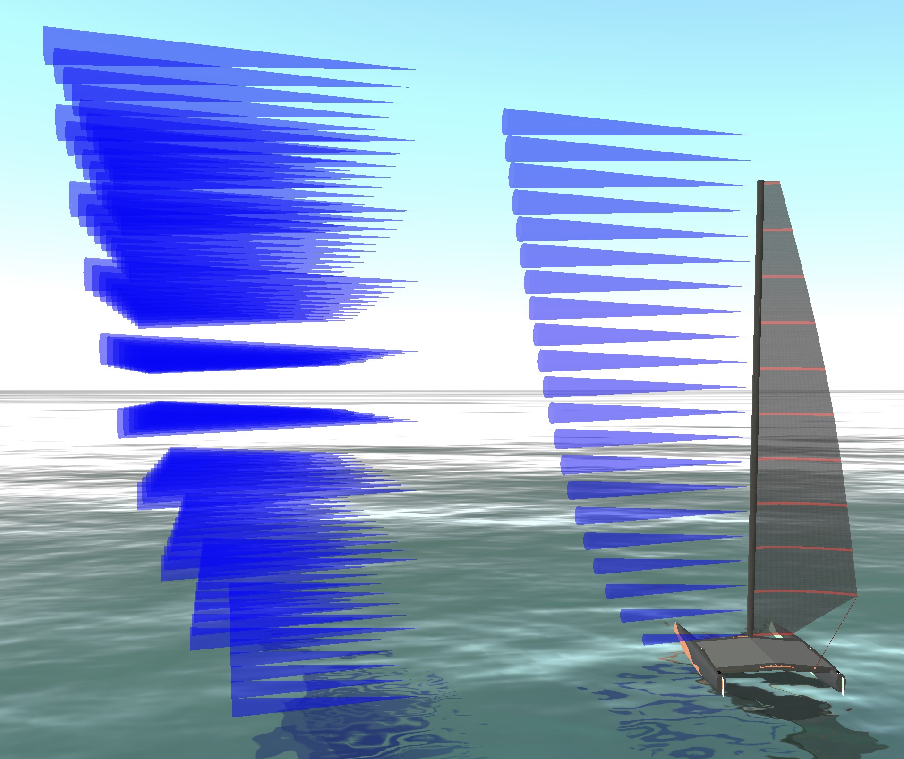][stable] | [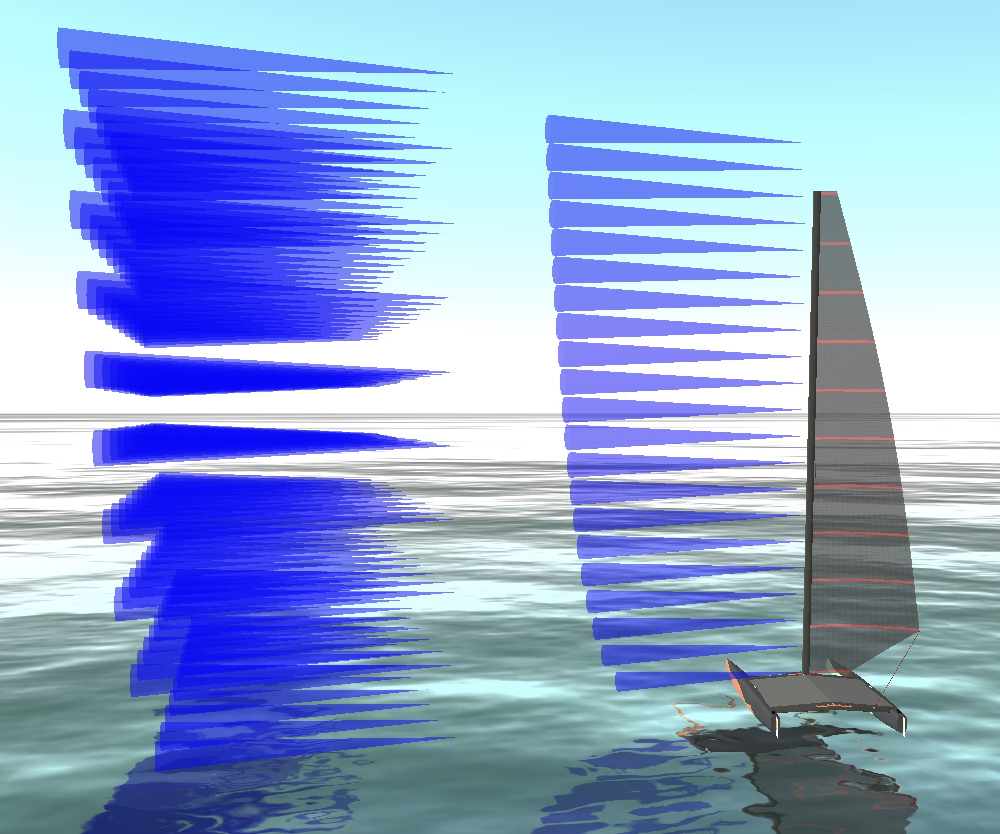][neutral] | [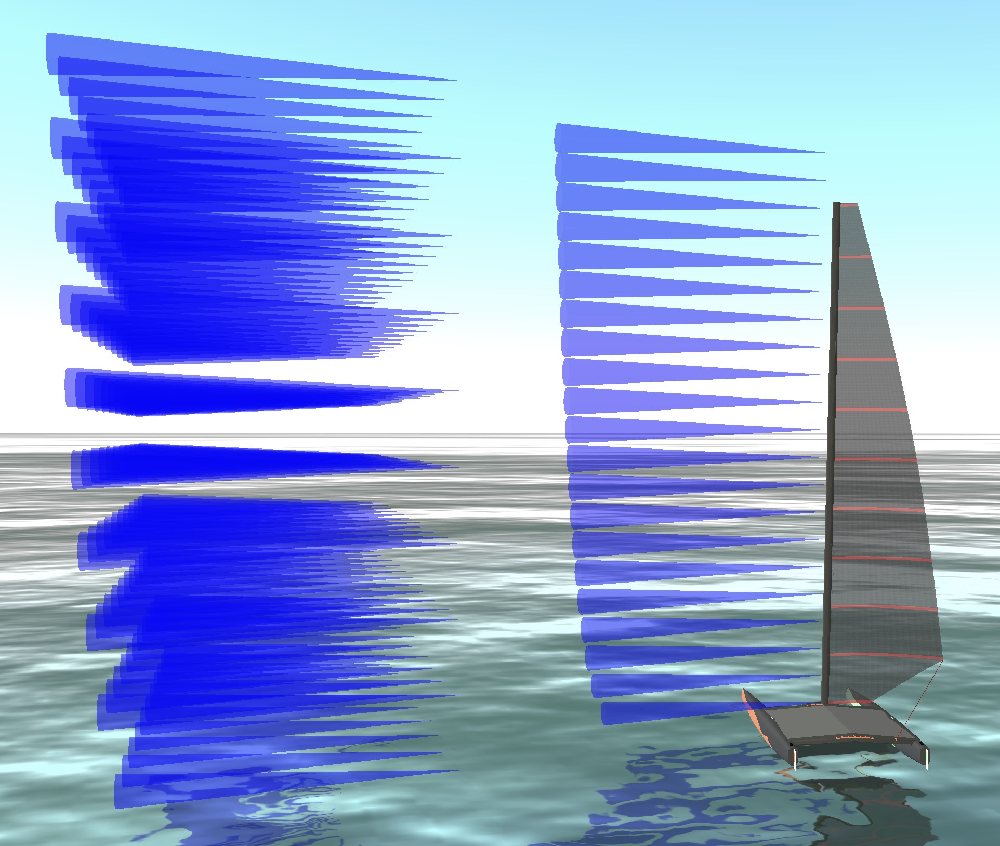][unstable] |
|a=0.27|a=0.1|a=0.06|

## Apparent Wind
Apparent wind is the combination of true-wind and fair-wind (headwind) and well explained in [wikipedia's apparent wind article][wikipediaapparrent]. It is the main but not only reason for trimming twist into the sail. On high speed boats, such as foiling catamarans one can sail faster than the true wind-speed by leveraging apparent winds as shown on below left picture, foiling downwind at 23kn boatspeed and 15kn windspeed. This picture shows further, that the sail trim is similar to upwind sail trim as the apparent wind comes from a 94° different direction than the true wind.

[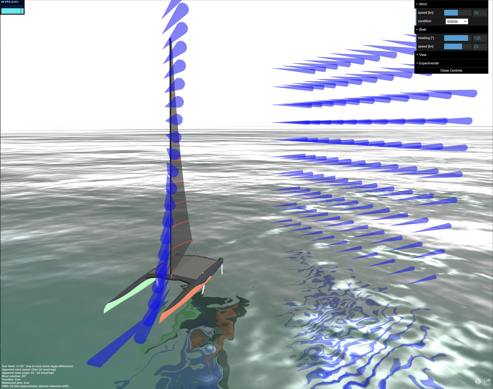](
https://simulator.atterwind.info/?bh=135&bs=23&ws=15&wh=0.27&ch=6.8&cs=13.9&cl=-3.8&cry=-26.8&crz=-5.4&crx=-11.8&cth=4.1&cts=0.8&ctl=3.0&csh=0 "View in simulator")[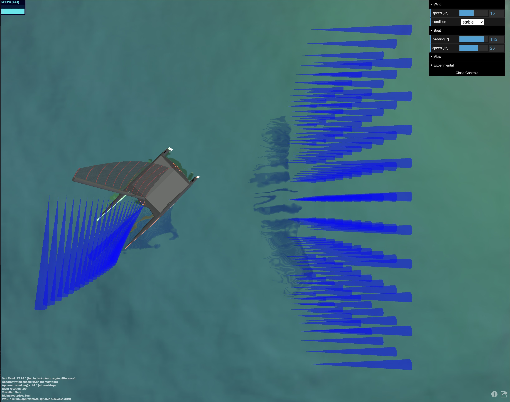](
https://simulator.atterwind.info/?bh=135&bs=23&ws=15&wh=0.27&ch=21.5&cs=0.3&cl=5.9&cry=0.0&crz=0.2&crx=-89.4&cth=4.1&cts=0.1&ctl=5.9&csh=0 "View in simulator")

Here is how it looks like on the water (not perfectly trimmed however, but thats why this site exists, to improve): 

[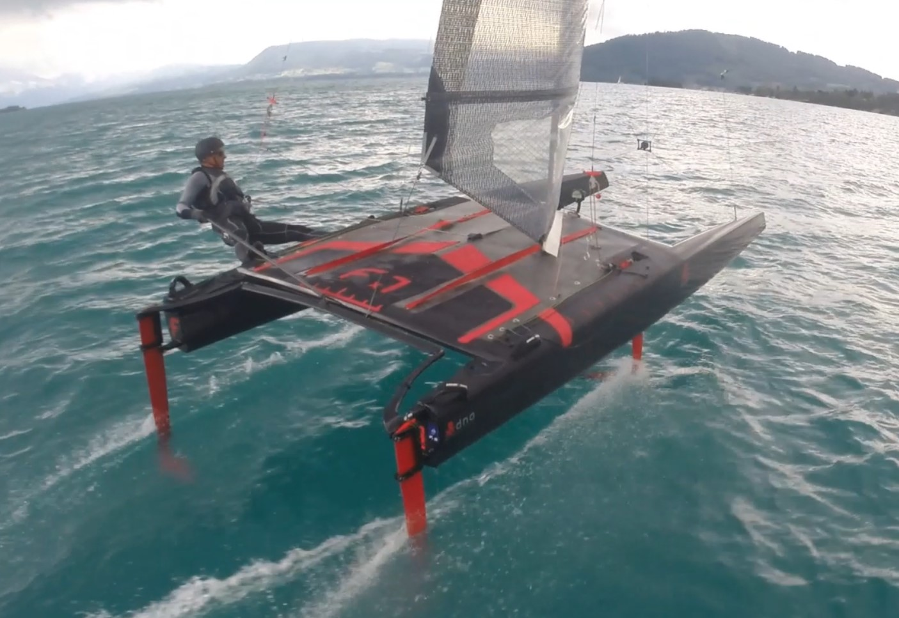](https://youtu.be/2CJ1vUJ1yvI?t=17)

As the true-wind has different speeds at different heights due to the wind-speed-gradient, while induced headwind is constant across hight (ignoring boat rocking), the resulting apparent wind comes from different directions at varying heights. So in theory, we can now shape the ideally trimmed sail by shaping it exactly in optimal angles to the apparent wind. The main reason for sail-twist.

## Sail Twist
There are following reasons for twisting the sail:
* shaping the sail (think airfoil wing) to always have the __right angle of attack to the apparent wind__ which changes direction and speed in height --- that's to me the main reason why the pro's say _twist is speed_.
* more __tolerance for dynamic wind changes__ twisted sail shape is more forgiving, as the broader range of angles to the wind keeps the airflow going and there is less risk for stalls
    * __quick gust peaks__ can turn the apparent wind windwards (and lulls obviuosly the other way) - according to [Frank Bethwaite's Higher Performance sailing](https://amzn.to/2OU08OV), wind speed increases and decreases rapidly by an average of +/- 7% every 6 to 12 seconds. His data shows they occur even in lake breezes, which are typically thought to be smooth, steady winds. 
    * __boat rocking__ due to waves moves the mast top back and forth which can change apparent wind direction a lot in the mast-top, hence you sail with more twist to be more tolerant of dynamic apparent wind direction changes
* __get the airflow over the sail going__ when the boat was stopped or slowed down after a tack
* __reduce power__ in the sail, as the twist can bring especially the top section of the sail closer into the wind reducing angle of attack and as such lift

How to adjust twist?
* __sheet-out the mainsheet__. This simulation sheets in and out automatically to meet the theoretical ideal twist. How much mainsheet to give to achieve the twist is displayed and bottom left in the text overlay. Note that this length is A-Class specific and you need to multiply this length with your pulley ratio. e.g. when the simulator shows 1cm give of mainsheet and you have a 12:1 purchase system, then it means you give 12cm with your hands. While this is not a precise metric, it provides the right magnitude.
* __restrict or force mast rotation__. The mast attributes approx. 10% of the entire 13.94m² sail area on an A-Class catamaran, so it has a significant impact have the right angle of attack of the mast to the wind. The simulator puts the mast rotation exactly into the angle of the front part of the parabolic wing shape. When enabling the display of detailed trim metrics, you can find the calculated angle of attack to the wind by the mast. With the simulators default parabolic sail shape this is about -4.4° degrees to the apparent wind (at 20° angle of attack). Think of the mast as the very front section of an airplane wing.
* __sheet-out the traveller__ to reduce twist while keeping the sail adjusted to the apparent wind on downwind courses. 

[downwindlight]: https://simulator.atterwind.info/?bh=135&bs=6&ws=6&wh=0.27&ch=13.0&cs=11.6&cl=-4.3&cry=-27.4&crz=-20.9&crx=-39.8&cth=4.1&cts=0.8&ctl=3.0&csh=0 (view in simulator)
[upwindfoiling]: https://simulator.atterwind.info/?bh=50&bs=17&ws=15&wh=0.27&ch=4.9&cs=-10.4&cl=-6.9&cry=-44.8&crz=-177.0&crx=-175.8&cth=4.3&cts=-1.8&ctl=1.6&csh=0 (view in simulator)

|[downwind, light winds, lots of twist][downwindlight]|[upwind, foiling, high-boat speed, little twist][upwindfoiling]|
|:---:|:---:|
|[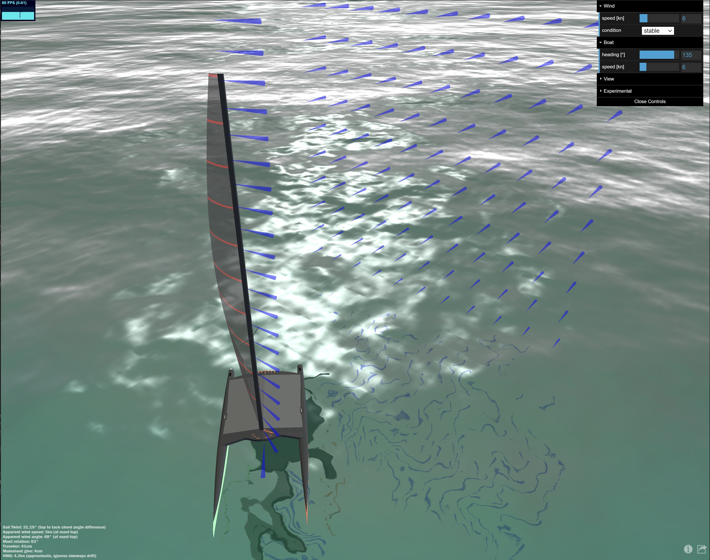][downwindlight]|[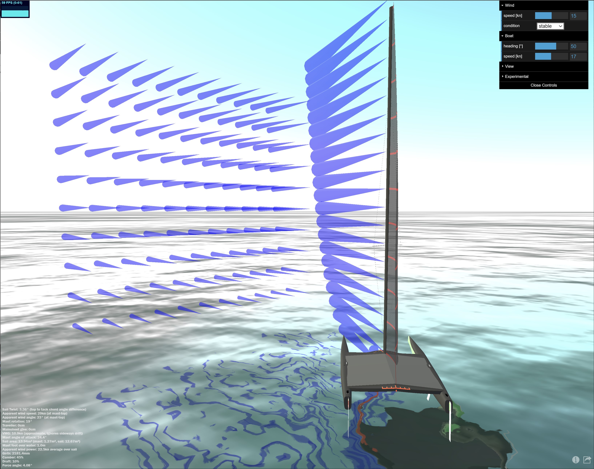][upwindfoiling]


# The Assumptions behind the Simulator

## Sail
Sails follow approximately a parabolic shape with it's max depth moved forward from the middle of the sail. Moving the camber or draft position forward from the 50% middle position, produces a better lift and comes close to a shape of a airwing. In practice camber position is moved forward towards a 36-45% position relative to chord length. In real world, the ways to move the camber position forward are:
* Asymmetrical shaped battens (one end is thicker then the others). Such battens are made to bend under longitudinal pressure already at positions of choice, so have their max bend-depth typically somewhere between 36% to 45% of length. [Fiberfoam battens](https://www.fiberfoam.net/products/technical-tips/) are designed and made with their position of maximum camber at between 38% and 45%. Similarily also [Dynaflex battens](https://dynaflexsailbattens.com/technology/).
* Pulling the cunningham bends the mast, flattens the sail, and moves the camber position forward. This changes also entry and exit angle of the sail shape. (cunningham is right now experimental in the simulator and I am not happy yet with the produced sail shape, but it provides already an idea)
* Mast rotation influences the shape. Popular [Fiberfoam tapered A-Class masts](https://www.catsailingnews.com/2015/02/a-class-dna-mast-now-built-by-fiberfoa.html) have a shape of 160×60 mm in the bottom to 130×45 mm in the top.
* For sure there is more, e.g. the how the sail is cut/made may influence the camber position too. 

[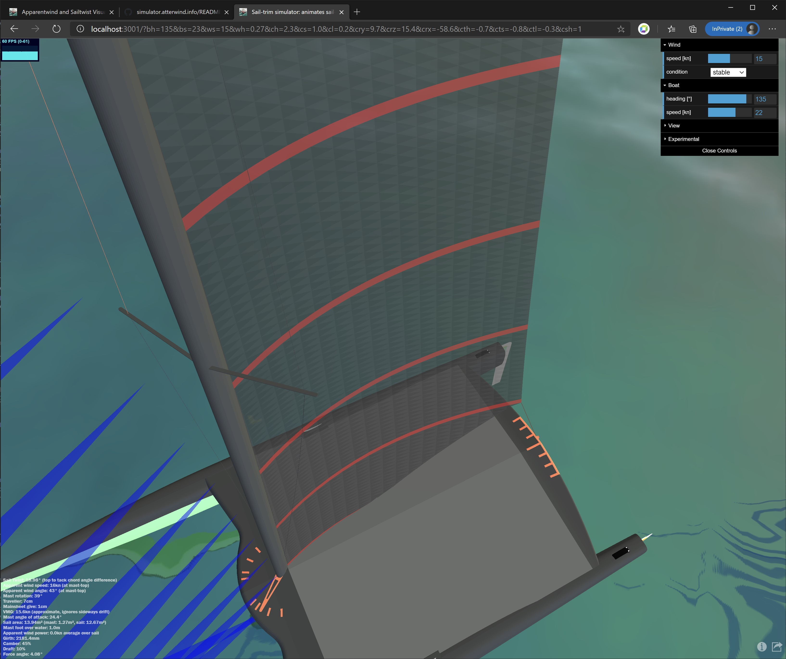](https://simulator.atterwind.info/?bh=135&bs=22&ws=15&wh=0.27&ch=5.8&cs=0.7&cl=1.2&cry=9.7&crz=15.4&crx=-58.6&cth=0.3&cts=-2.7&ctl=0.1&csh=1)

The simulation calculates the sail-shape in two steps. First it is modeling a flat 2D version of a sail, with dimensions listed below in the table, and evently distributed mesh points. Then the sail shape is calculated based on Lester Gilbert's great summary of calculating a parabolic sail shape design and the surrounding theory, which is provided on [onemetre.net][onemetre]. This parabolic shape is transformed into rotations, which are applied to all the mesh-points or vortices of the sail, turning the 2D sail into a 3D shaped sail. This approach simplifies modeling sail twist, by calculating apparent wind at each level of the sail and adding this rotation change to the rotation already determined for the sail shape. Limiting the max rotation difference between nearby levels of the sail lets, e.g. max 1° rotation difference between sail height of 1000mm vs. 1010mm is a simple approximation to limit stretching of the virtual sail material.

|metric|value|comment|
|---:|:---|:---|
|camber position|45%|Camber or draft is slightly forward from middle|
|camber depth|10%|this is % of chord length|
|chord at tack|2125mm|this is tack distance from mast of a powered sail. approximately the boom length minus outhaul length from boom tip|
|chord at mast top|390mm|the sail shape at the mast top is simply a scaled down version of the shape at the tack level|
|tack height|900mm|tack position above deck|
|mast and sail height|9065mm||
|mast width|140mm|the mast is treated as part of the parabolic sail shape and follows its shape and entry angle|
|decksweeper width|900mm|decksweeper area is treated differently, it follows the sail shape of the tack height and gets clipped off|
|leech curvature|200mm|A-Cat sails are open in design, only limited to 13.94m² in area including the mast. This curvature has been picked arbitrary to visually look closer to the real-world sails.|
|sail area|13.94m²|The simulator calculates the area of the parabolic shaped sail by summing up the area of the triangular faces.|
|girth at tack|2181mm|Girth is calculated numerically summing up the distance of 1000 points that are modeled along the parabolic shape, after scaling it to match the chord length|
|angle of attack|20°|Apparent wind direction vs. sail chord, this drives the sail twist math (15°-20° are good angles)|
|foiling height|52cm|Moves the entire sail to a 52cm higher position|

Note, when boat is foiling, what happens at 13kts+, then the boat lifts by 52cm, thus sail is higher above water what has a slight impact on twist in lower sail area. 

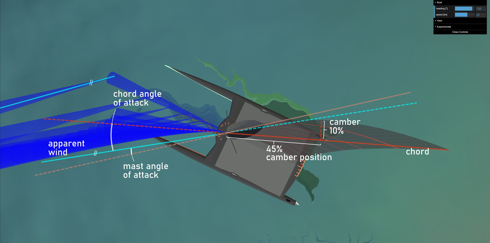

## Mast rotation
Mast rotation is visualized as it appears on the [DNA F1x A-Cat][dnaf1x]. The red pointer on the mast foot is the mast-rotation arm, used to limit or force rotation on real boats. The simulator infers mast rotation from the front section of the sail shape, so that the mast virtually follows exactly the calculated parabolic shape. With default settings, mast angle of attack to apparent wind is rounded -5°.

|marker|angle|
|:---:|:---:|
| \| | 20° |  
| \|\| | 30° |  
| \|\|\| | 50° |  
| \|\|\|\| | 70° |  
| max | 90° | 

[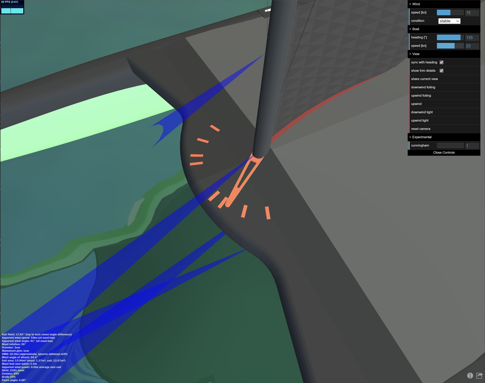](
https://simulator.atterwind.info/?bh=135&bs=23&ws=15&wh=0.27&ch=2.3&cs=1.0&cl=0.2&cry=9.7&crz=15.4&crx=-58.6&cth=-0.7&cts=-0.8&ctl=-0.3&csh=1)
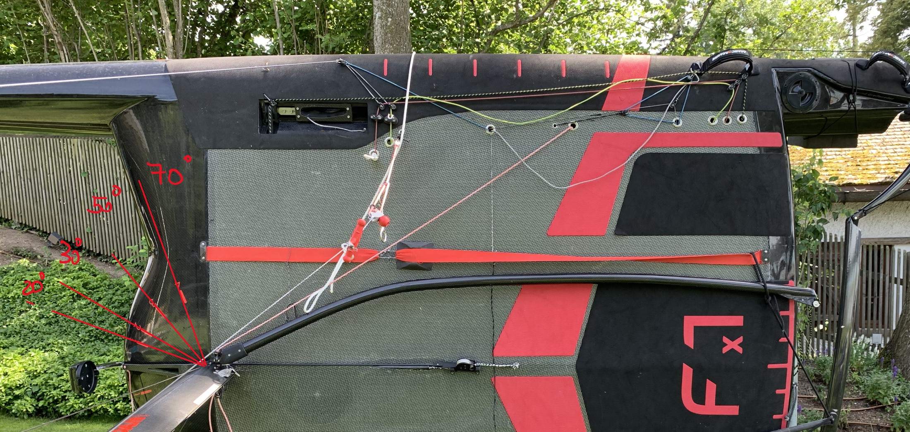

## Traveller
The traveller is also visualized as it appears on the [DNA F1x A-Cat][dnaf1x]. It's markers are setup in 10cm distance from each, with max 80cm position off centre. Below picture shows the traveller 18cm off-centre.

[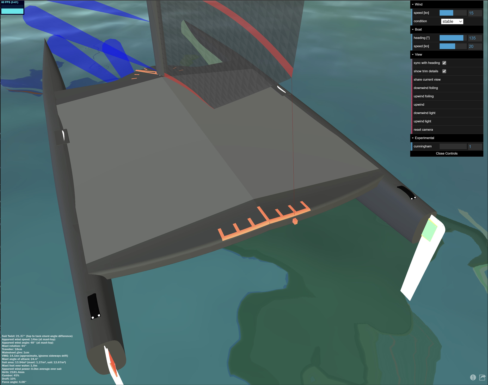](https://simulator.atterwind.info/?bh=135&bs=20&ws=15&wh=0.27&ch=2.6&cs=-2.1&cl=3.3&cry=46.0&crz=118.9&crx=-111.7&cth=-0.7&cts=-0.8&ctl=-0.3&csh=1)

The traveller position is calculated through virtually elongating the leech of the sail to the transom. When there is no sail-twist (i.e. heading directly into the wind), the traveler position is exactly aligned to the horizontal sideways sail tack position. 
Now when there is sail-twist, the additional traveller movement is determined by virtually elongating the leech to the transom. This is a simple linear connection from the tack, the next leechpoint above the tack, and calculating the intersection at the transom leveraging simply the lever principle. 

## Experimental settings: Cunningham, Angle of Attack
* __Cunningham__ setting modifies the parabolic shape of the simulated sail to move the draft/camber forward. I am not fully happy with the resulting shape but feel free to play with it. It primarily changes the lift-force vector and it will become relevant when calculating sail lift and momentum. Cunningham simulation should potentially flatten the sail too. 
* __Outhaul__ might be another optional setting to flatten the sail from its default 10% draft.
* __Angle of attack__ of e.g. 20° is a targeted angle that can be met when bearing away enough from the wind. According to [Lester Gilbert's][onemetre] research 20° is optimum lift, but I am finding that 15° brings the simulator closer to real-world settings. [Thoughts?][discussion]

# Real world comparision

Let's compare this simulator with real-world trim settings recommended by the Pro's like [Mischa Heemskerk](https://www.mischaheemskerk.com/) who also builds the [DNA F1x][dnaf1x] catamaran (yes, by now it's obvious, thats the boat I am sailing). 

Here is Mischa's table:

|true wind speed|0-6kn|7-11kn|12-15kn|16kn+|0-7kn|7-9kn|10-16kn|17kn+|
|-:|:-:|:-:|:-:|:-:|:-:|:-:|:-:|:-:|
|course|upwind|upwind|upwind|upwind|downwind|downwind|downwind|downwind|
|mast rotation [°]|50|30|25|20|70|30|40|50|50|
|cunningham|mid|light|mid|pull|mid|loose|mid|pull|
|traveller [cm]|0|0|0|5-10|max (80?)|10|20|30|

<br>

### Simulator with guesstimated boat speed (need a polar!)
This table is a big guesstimate right now as I need a polar diagram and more accurate real-world measurements of boat-speed and VMG vs. the rest of the settings.

|true wind speed|0-6kn|7-11kn|12-15kn|16kn+|0-7kn|7-9kn|10-16kn|17kn+|
|-:|:-:|:-:|:-:|:-:|:-:|:-:|:-:|:-:|
|simulator|[view][upwind1]|[view][upwind2]|[view][upwind3]|[view][upwind4]|[view][downwind1]|[view][downwind2]|[view][downwind3]|[view][downwind4]|
|course|upwind|upwind|upwind flying|upwind foiling|downwind|downwind foiling|downwind foiling|downwind foiling|
|wind speed [kn]|4|9|14|20|5|8|14|20|
|heading [°]|45|45|45|50|135|130|140|150|
|boat speed [kn]|3|8|11|20|5|15|20|25|
|vmg [kn]|2.1|5.7|7.8|12.9|3.5|9.6|16.4|21.7|
|twist [°]|6|4|5|6|31|13.4|21|28|
|sail chord angle of attack [°]|20|20|20|__15__|__15__|__15__|__15__|__15__|
|apparent wind speed at mast top [kn]|6|16|23|36|4|12|12|13|
|mast rotation [°]|21 _vs. 50_|19 _vs. 30_|21 _vs. 25_|25 _vs. 20_|68 _vs. 70_|32 _vs. 30_|44 _vs. 40_|53 _vs. 50_|
|traveller [cm]|0|0|1 _vs. 0_|11 _vs. 5-10_|57 _vs. max_|6 _vs. 10_|16 _vs. 20_|24 _vs. 30_|

When the table shows a _vs._ then it is simulator _vs. Mischa's real-world-best-practice_.

First conclusions: Calculations were based on 20° angle of apparent wind vs. sail chord. Adjusting angle of attack to 15° OR reducing the Hellman constant (for reduced wind-gradient) brings closer results. The result is close enough to get a rough feel, and wanting to get back on the water to try some trims in the real-world.


[upwind1]: https://simulator.atterwind.info/?bh=45&bs=3&ws=4&wh=0.27&ch=17.0&cs=-1.9&cl=2.0&cry=9.4&crz=134.6&crx=-99.2&cth=5.0&cts=0.0&ctl=0.0&csh=0&vd=1 (view in simulator)
[upwind2]: https://simulator.atterwind.info/?bh=-45&bs=8&ws=9&wh=0.27&ch=12.3&cs=-9.3&cl=-3.6&cry=-16.9&crz=-167.1&crx=-141.7&cth=5.0&cts=0.0&ctl=0.0&csh=0&vd=1 (view in simulator)
[upwind3]: https://simulator.atterwind.info/?bh=-45&bs=11&ws=14&wh=0.27&ch=11.9&cs=2.9&cl=9.8&cry=52.8&crz=62.2&crx=-67.2&cth=5.0&cts=0.0&ctl=0.0&csh=0&vd=1 (view in simulator)
[upwind4]: https://simulator.atterwind.info/?bh=-50&bs=20&ws=20&wh=0.27&ch=10.3&cs=4.8&cl=-0.5&cry=-6.3&crz=-11.2&crx=-60.9&cth=2.4&cts=0.4&ctl=0.5&saa=15&vd=1 (view in simulator)
[downwind1]: https://simulator.atterwind.info/?bh=135&bs=5&ws=5&wh=0.27&ch=11.9&cs=2.9&cl=9.8&cry=52.8&crz=62.2&crx=-67.2&cth=5.0&cts=0.0&ctl=0.0&csh=0&saa=15&vd=1 (view in simulator)
[downwind2]: https://simulator.atterwind.info/?bh=130&bs=15&ws=8&wh=0.27&ch=7.2&cs=-1.6&cl=3.0&cry=25.8&crz=101.0&crx=-94.9&cth=3.0&cts=-1.3&ctl=0.9&csh=0&saa=15&vd=1 (view in simulator)
[downwind3]: https://simulator.atterwind.info/?bh=145&bs=20&ws=14&wh=0.27&ch=9.0&cs=-0.2&cl=5.1&cry=41.1&crz=89.5&crx=-89.7&cth=4.2&cts=-0.2&ctl=1.0&csh=0&saa=15&vd=1 (view in simulator)
[downwind4]: https://simulator.atterwind.info/?bh=150&bs=25&ws=20&wh=0.27&ch=4.6&cs=-1.1&cl=4.3&cry=51.1&crz=102.7&crx=-100.0&cth=1.0&cts=-0.5&ctl=-0.2&csh=0&saa=15&vd=1 (view in simulator)

# Usage details
## Using mouse, touch and keyboard

### Keyboard
|key|function|
|-|-|
|arrow-up/down|boat speed +/-1kn|
|arrow-left/right|boat heading -/+1°|

### Touch orbit control
|||
|-|-|
|one finger|rotate|
|two fingers|zoom, pan|

### Mouse orbit control
|||
|-|-|
|left mouse button + move|rotate|
|right mouse button|pan|
|mid mouse button + move|zoom|
|scrolling wheel|zoom|


## URL parameters
The simulator can be configured with URL query string parameters. You get those parameters automatically when clicking the _share current view_ button, but you can also explicitly feed the simulator this way.

```https://simulator.atterwind.info/?bh=135&bs=20&ws=15&wh=0.27&ch=2.6&cs=-2.1&cl=3.3&cry=46.0&crz=118.9&crx=-111.7&cth=-0.7&cts=-0.8&ctl=-0.3&csh=1```

|parameter|default|unit|description|
|:---|:---|:---|:---|
|bh|0|°|angle of boat heading vs. true wind, also called course over ground (COG)|
|bs|5|kn|boat speed over ground (SOG)|
|ws|5|kn|true wind speed (TWS) at 10m height over water|
|wh|0.27|Hellman number|wind condition defined by hellman number, 0.27 is the default for stable wind|
|ch|10.0|m|camera position height|
|cs|8.0|m|camera position aside|
|cl|8.0|m|camera position along|
|crx|-32.0|°|camera rotation X|
|cry|40.3|°|camera rotation Y|
|crz|22.0|°|camera rotation Z|
|cth|5.0|m|camera target height|
|cts|0.0|m|camera target aside|
|ctl|0.0|m|camera target along|
|csh|0|0 or 1|1 to sync camera with boat heading rotation|
|vd|0|0 or 1|view details about trim and simulator calculations|
|saa|20|experimental: sail angle of attack vs apparent wind|
|sc|1|0 or 1|experimental: cunningham 1 soft .. 10 hard|

# Feedback, Legal, Credits and more
## Feedback and discussions
[discussion]: https://github.com/flyinggorilla/simulator.atterwind.info/discussions (atterwind simulator discussion forum on github)

[Discussion forum on GitHub][discussion]

## Credits go to great sources used in this project:
* threejs: https://threejs.org/ 3D WebGL library
* water animation: https://github.com/mrdoob/three.js/blob/master/examples/webgl_shaders_ocean.html 
* a-cat: the A-Cat model is derived from https://grabcad.com/library/class-a-catamaran-1 and changed to DNA F1x hull shape, and mast moved forward to allow for proper 13.94m2 sail area.
* [Onemetre.net][onemetre] for the great collection of sail design theory and practical math models

## License
* https://simulator.atterwind.info is a free non-commercial ad-free service for the sailing community. It is licensed under [GNU Affero General Public License v3.0](https://choosealicense.com/licenses/agpl-3.0/)

## Videos
* My youtube channel: https://www.youtube.com/channel/UCwhb6u4A_Hy-c-eJbMLW7bg

## Todo List
* MOST-WANTED: [__polar diagram data__][polardiagram] to provide max speed info (vs. wishful speeds of) to enable "realistic constraints", and to simulate the twist and heading change as the boat picks up speed. If anyone has such an A-Class polar, please share.
    * Leverage [Sailmon MAX](https://sailmon.com/max/) with [Calypso Ultrasonic Anemometer](https://calypsoinstruments.com) to get data for deriving a polar.
* Force moments and equilibrium
    * visualize [force on sail][forcesonsails]
    * simulate a body sitting, hiking or trapezing 
    * detect overpowered sail and adjust simulated twist and/or flatten the sail, pull cunningham 
* Additional experimental settings
    * outhaul
* Gimmicks
    * add water spray & boat speed visualization
    * add WebXR (VR) capability -- update threejs for that


[dnaf1x]: https://dnaperformancesailing.com/our-boats/f1x-a-class-foiling-catamaran/
[onemetre]: http://www.onemetre.net/design/Parab/Parab.htm
[wikipediaapparrent]: https://en.wikipedia.org/wiki/Apparent_wind
[wikipediagradient]: https://en.wikipedia.org/wiki/Wind_gradient
[forcesonsails]: https://en.wikipedia.org/wiki/Forces_on_sails (wikipedia: forces on sails)
[polardiagram]: https://en.wikipedia.org/wiki/Polar_diagram_(sailing) (wikipedia: polar diagram)


