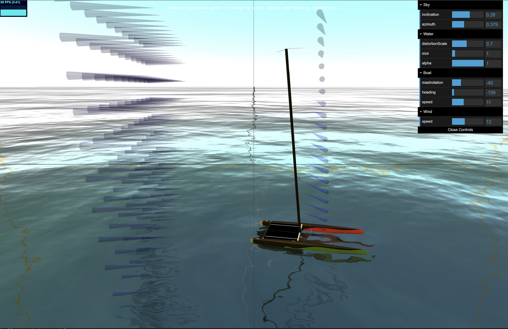

## https://simulator.atterwind.info
# Apparent wind simulator for sailtwist analysis
This simulation visualizes wind sheer and how it influences apparent wind at various boat headings. Understanding apparent wind directions at top, mid and lower parts of sail is helpful learning sail-trim.

DONE:
* improve wind indicator position by using treejs GROUPS to set pivot points at the cone tip
* allow adjusting wind-sheer to stable or gusty wind-conditions
* quicksettings: "downwind foiling", "downwind light winds", "upwind foiling", "upwind max height", "reaching"
TODO:
* add "info" button and create a windsheer and twist explainer page
* vizualize sail, and add "angle of attack" 
* add water spray & boat speed visualization (simple lines or particle engine)
https://stemkoski.github.io/Three.js/Particle-Engine.html 
* add WebXR (VR) capability -- update threejs for that

### Credits go to great sources used in this project:
* threejs: https://threejs.org/ 3D WebGL library
* water animation: https://github.com/mrdoob/three.js/blob/master/examples/webgl_shaders_ocean.html 
* a-cat: the A-Cat model is derived from https://grabcad.com/library/class-a-catamaran-1 and changed to DNA F1x hull shape, and mast moved forward to allow for proper 13.94m2 sail area.

### Further references:
* wind sheer: https://en.wikipedia.org/wiki/Wind_gradient
* apparent wind: https://en.wikipedia.org/wiki/Apparent_wind 
