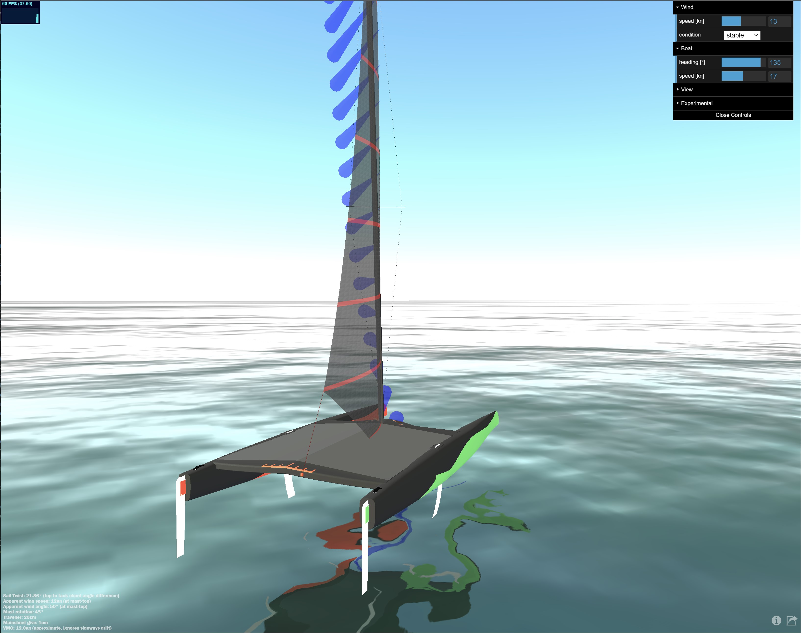

## https://simulator.atterwind.info
# Apparent Wind Sail-Trim Simulator 
This simulator trims an [A-Class catamaran](https://www.a-cat.org/) towards apparent wind. While this is an idealization, it comes close enough to get a better understanding of sail-trim. Basic sail-twist concepts apply to all other catamarans like [Nacra 15](https://nacrasailing.com/our-boats/daggerboard-boats/nacra-15/) or [Nacra 17](https://nacra17.org/) as well as dinghys such as [Laser](http://www.laserinternational.org/) or [RS Aero](https://en.wikipedia.org/wiki/RS_Aero) too, just ignore lack of jib of the former and mast rotation, traveller on the latter. 
* learn and understand true-wind vs. __apparent wind__ and it's impact to __sail-twist__ and trim
* improve __sail-trim__ on the water with better understanding of how much sail-twist, mast-rotation and traveler move is needed in certain situations
* __share simulator views__ as URL hyperlinks with others, as baseline to discuss real-world trim improvements



Quick intro on how to use this simulator:
1. __adjust true-wind speed__ in knots. it's direction is irrelevant for the simulation.
1. __adjust wind condition__, stable thermal winds have higher wind gradient impact than gusty unstable winds
1. __adjust boat heading__ in degrees relative to true-wind direction - e.g. 50° for upwind, and 135° for downwind. 
1. __adjust boat speed__ in knots that you estimate to fit to wind and heading. The simulated foiling A-Cat will fly at 13+ knots. Because it's a simulator, have also fun sailing practically impossible configurations.
1. click _share current view_ to __bookmark__ this view or __share__ it as Web link with others

# Basics
## Wind Speed Gradient 
Surface friction causes the wind speed to be close to zero at the surface, meaning that the air molecules are slowed down by the water surface. Slow air molecules also slow down the air above them and so forth. This causes a gradient of wind speeds, also called wind shear. This simulation calculates the wind gradient based on this [wind turbine research][1]. Results are similar to studies by Frand Bethwaite's High Performance Sailing. When looking at the three screenshots below, you see on each on the left the true-wind-field. The cone points into the direction of wind flow and represents wind-speed by it's length. You will notice that the biggest wind speed gradient impact is in the lower third 0-3m range of the ~10m high boat. The leftmost configuration shows stable winds, which have highest wind sheer and the right most unstable gusty wind conditions. Those conditions are specified in the formula by the _Hellman_ constant _a_. The apparent wind is visualized in front of the mast of the catamaran. However, as in this configuration the boat is not moving, the apparent wind gradient equals the true wind gradient. 

[stable]: https://simulator.atterwind.info/?bh=103&bs=0&ws=25&wh=0.27&ch=5.5&cs=-21.7&cl=10.2&cry=13.7&crz=179.4&crx=-177.6&cth=4.5&cts=2.8&ctl=4.3&csh=0 (view in simulator)

[neutral]: https://simulator.atterwind.info/?bh=103&bs=0&ws=25&wh=0.1&ch=5.5&cs=-21.7&cl=10.2&cry=13.7&crz=179.4&crx=-177.6&cth=4.5&cts=2.8&ctl=4.3&csh=0 (view in simulator)

[unstable]: https://simulator.atterwind.info/?bh=103&bs=0&ws=25&wh=0.06&ch=5.5&cs=-21.7&cl=10.2&cry=13.7&crz=179.4&crx=-177.6&cth=4.5&cts=2.8&ctl=4.3&csh=0 (view in simulator)

| [stable][stable] | [neutral][neutral] | [unstable][unstable] |
|:---:|:---:|:---:|
| [][stable] | [][neutral] | [][unstable] |
|a=0.27|a=0.1|a=0.06|

## Apparent Wind
Apparent wind is the combination of true-wind and fair-wind (headwind) and well explained in [wikipedia's apparent wind article][2]. It is the main but not only reason for trimming twist into the sail. On high speed boats, such as foiling catamarans one can sail faster than the true wind-speed by leveraging apparent winds as shown on below left picture, foiling downwind at 23kn boatspeed and 15kn windspeed. This picture shows further, that the sail trim is similar to upwind sail trim as the apparent wind comes from a 94° different direction than the true wind.

[](
https://simulator.atterwind.info/?bh=135&bs=23&ws=15&wh=0.27&ch=6.8&cs=13.9&cl=-3.8&cry=-26.8&crz=-5.4&crx=-11.8&cth=4.1&cts=0.8&ctl=3.0&csh=0 "View in simulator")[](
https://simulator.atterwind.info/?bh=135&bs=23&ws=15&wh=0.27&ch=21.5&cs=0.3&cl=5.9&cry=0.0&crz=0.2&crx=-89.4&cth=4.1&cts=0.1&ctl=5.9&csh=0 "View in simulator")

Here is how it looks like on the water (not perfectly trimmed however, but thats why this site exists, to improve): 

[](https://youtu.be/2CJ1vUJ1yvI?t=17)

As the true-wind has different speeds at different heights due to the wind-speed-gradient, while induced headwind is constant across hight (ignoring boat rocking), the resulting apparent wind comes from different directions at varying heights. So in theory, we can now shape the ideally trimmed sail by shaping it exactly in optimal angles to the apparent wind. The main reason for sail-twist.

## Sail Twist
There are following reasons for twisting the sail:
* shaping the sail (think airfoil wing) to always have the __right angle of attack to the apparent wind__ which changes direction and speed in height --- that's to me the main reason why the pro's say _twist is speed_.
* more __tolerance for dynamic wind changes__ twisted sail shape is more forgiving, as the broader range of angles to the wind keeps the airflow going and there is less risk for stalls
    * __gusts__ can turn the apparent wind windwards (and lulls obviuosly the other way)
    * __boat rocking__ due to waves moves the mast top back and forth which can change apparent wind direction a lot in the mast-top, hence you sail with more twist to be more tolerant of dynamic apparent wind direction changes
* __get the airflow over the sail going__ when the boat was stopped or slowed down after a tack
* __reduce power__ in the sail, as the twist can bring especially the top section of the sail closer into the wind reducing angle of attack and as such lift

How to adjust twist?
* __sheet-out the mainsheet__ - this simulator displays bottom left in the text overlay how much mainsheet to give to achieve the twist. Note that this length is A-Class specific and you need to multiply this length with your pulley ratio. e.g. when the simulator shows 1cm give of mainsheet and you have a 12:1 purchase system, then it means you give 12cm with your hands.
* __restrict or force mast rotation__. The mast attributes approx. 10% of the entire 13.94m² sail area on an A-Class catamaran, so it has a significant impact have the right angle of attack of the mast to the wind. When enabling the display of detailed trim metrics, you can find the calculated angle of attack to the wind by the mast. With the simulators default parabolic sail shape this is about -4.4° degrees to the apparent wind. Think of the mast as the very front section of an airplane wing.
* __sheet-out the traveller__ to reduce twist while keeping the sail adjusted to the apparent wind on downwind courses. 

[downwindlight]: https://simulator.atterwind.info/?bh=135&bs=6&ws=6&wh=0.27&ch=13.0&cs=11.6&cl=-4.3&cry=-27.4&crz=-20.9&crx=-39.8&cth=4.1&cts=0.8&ctl=3.0&csh=0 (view in simulator)
[upwindfoiling]: https://simulator.atterwind.info/?bh=50&bs=17&ws=15&wh=0.27&ch=4.9&cs=-10.4&cl=-6.9&cry=-44.8&crz=-177.0&crx=-175.8&cth=4.3&cts=-1.8&ctl=1.6&csh=0 (view in simulator)

|[downwind, light winds, lots of twist][downwindlight]|[upwind, foiling, high-boat speed, little twist][upwindfoiling]|
|:---:|:---:|
|[][downwindlight]|[][upwindfoiling]


# The (Non-)Scientific assumptions behind the Simulator

## Sail
Sails are in theory shaped parabolic shape with it's max depth right in the middle of the sail. We'd say camber or draft position of 50%, producing a suboptimal lift coefficient, hence a less effective wing shape of the sail. Shapes with camber position moved forward towards a 35-45% chord position provide better lift coefficients. Ways to move the chord forward are:
* Asymmetrical shaped battens (one end is thicker then the others). Such battens are made to bend under longitudinal pressure already at positions of choice, so have their max bend-depth typically somewhere between 36% to 45% of length. [Fiberfoam battens](https://www.fiberfoam.net/products/technical-tips/) are designed and made with their position of maximum camber at between 38% and 45%. Similarily also [Dynaflex battens](https://dynaflexsailbattens.com/technology/).
* Pulling the cunningham bends the mast, flattens the sail, and moves the camber position forward. This changes also entry and exit angle of the sail shape. (cunningham is right now experimental in the simulator and I am not happy yet with the produced sail shape, but it provides already an idea)
* Mast rotation influences the shape. Popular [Fiberfoam tapered A-Class masts](https://www.catsailingnews.com/2015/02/a-class-dna-mast-now-built-by-fiberfoa.html) have a shape of 160×60 mm in the bottom to 130×45 mm in the top. 
* I assume the how the sail is cut/made influences the shape too. 

[](https://simulator.atterwind.info/?bh=135&bs=22&ws=15&wh=0.27&ch=5.8&cs=0.7&cl=1.2&cry=9.7&crz=15.4&crx=-58.6&cth=0.3&cts=-2.7&ctl=0.1&csh=1)

### Simulator assumptions
A great summary of calculating a parabolic sail shape design and the surrounding theory is provided on [onemetre.net][onemetre]. This simulator follows that math for building the models.

|metric|value|comment|
|:--- |:---|:---|
|Camber position|45%|Camber or draft is slightly forward from middle|
|Camber depth|10%|this is % of chord length|
|Chord|2125mm|this is tack distance from mast of a powered sail. approximately the boom length minus outhaul length from boom tip|
|Angle of attack|20°|Apparent wind direction vs. sail chord, this drives the sail twist math|
|Foiling height|50cm|Moves the entire sail to a 50cm higher position|

## Mast rotation
Mast rotation is visualized as it appears on the [DNA F1x A-Cat][dnaf1x]. 

|marker|angle|
|:---:|:---:|
| \| | 20° |  
| \|\| | 30° |  
| \|\|\| | 50° |  
| \|\|\|\| | 70° |  
| max | 90° | 

[](
https://simulator.atterwind.info/?bh=135&bs=23&ws=15&wh=0.27&ch=2.3&cs=1.0&cl=0.2&cry=9.7&crz=15.4&crx=-58.6&cth=-0.7&cts=-0.8&ctl=-0.3&csh=1)


## Traveller
The traveller is also visualized as it appears on the [DNA F1x A-Cat][dnaf1x]. It's markers are setup in 10cm distance from each, with max 80cm position off centre. Below picture shows the traveller 18cm off-centre.

[](https://simulator.atterwind.info/?bh=135&bs=20&ws=15&wh=0.27&ch=2.6&cs=-2.1&cl=3.3&cry=46.0&crz=118.9&crx=-111.7&cth=-0.7&cts=-0.8&ctl=-0.3&csh=1)


## URL parameters
The simulator can be configured with URL query string parameters. You get those parameters automatically when clicking the _share current view_ button, but you can also explicitly feed the simulator this way.

```https://simulator.atterwind.info/?bh=135&bs=20&ws=15&wh=0.27&ch=2.6&cs=-2.1&cl=3.3&cry=46.0&crz=118.9&crx=-111.7&cth=-0.7&cts=-0.8&ctl=-0.3&csh=1```

|parameter|default|unit|description|
|:---|:---|:---|:---|
|bh|0|°|angle of boat heading vs. true wind, also called course over ground (COG)|
|bs|5|kn|boat speed over ground (SOG)|
|ws|5|kn|true wind speed (TWS) at 10m height over water|
|wh|0.27||wind condition defined by hellman constant, 0.27 is the default for stable wind|
|ch|10.0|m|camera position height|
|cs|8.0|m|camera position aside|
|cl|8.0|m|camera position along|
|crx|-32.0|°|camera rotation X|
|cry|40.3|°|camera rotation Y|
|crz|22.0|°|camera rotation Z|
|cth|5.0|m|camera target height|
|cts|0.0|m|camera target aside|
|ctl|0.0|m|camera target along|
|csh|0|0 or 1|1 to sync camera with boat heading rotation|

# Feedback, Legal, Credits and more
## Feedback and discussions
https://github.com/flyinggorilla/simulator.atterwind.info/discussions

## Credits go to great sources used in this project:
* threejs: https://threejs.org/ 3D WebGL library
* water animation: https://github.com/mrdoob/three.js/blob/master/examples/webgl_shaders_ocean.html 
* a-cat: the A-Cat model is derived from https://grabcad.com/library/class-a-catamaran-1 and changed to DNA F1x hull shape, and mast moved forward to allow for proper 13.94m2 sail area.
* [Onemetre.net][onemetre] for the great collection of sail design theory and practical math models

## License
* https://simulator.atterwind.info is a free non-commercial ad-free service for the sailing community. It is licensed under [GNU Affero General Public License v3.0](https://choosealicense.com/licenses/agpl-3.0/)

## Videos
My youtube channel: https://www.youtube.com/channel/UCwhb6u4A_Hy-c-eJbMLW7bg

## Todo List
* MOST-WANTED: a __polar__ to provide max speed info (vs. wishful speeds of) to enable "realistic constraints", and to simulate the twist and heading change as the boat picks up speed. If anyone has such an A-Class polar, please share.
* Additional experimental settings
    * angle of attack
    * outhaul
* Force moments and equilibrium
    * visualize force on sail
    * simulate a body sitting, hiking or trapezing 
* Gimmicks
    * add water spray & boat speed visualization
    * add WebXR (VR) capability -- update threejs for that


[dnaf1x]: https://dnaperformancesailing.com/our-boats/f1x-a-class-foiling-catamaran/
[onemetre]: (http://www.onemetre.net/design/Parab/Parab.htm)


# README TODO/WIP


* experimental cunningham adjustment moves the camber a bit forward to 38% - that part is right now more guesstimates
* 
   

* reality constraints
    * impossible settings are possible (e.g. you can go straight downwind faster than the wind )
    * mast rotation max 90????
    * WANTED: polar data for foiling A-Cat


* cunningham
* unrealistic (angle of force moves way too much fore)
    * TODO: rescale parabolic shape based on % camber/draft/depth so to ; problem is that parabolic shape changes  the girth length what is obviously a constant (unless you change the sail)
    
* metrics
    * top of sail: 8.35m
    * mid of sail: 5m
    * lower third: 1.65m
    * note when boat is foiling, what happens at 13kts+ (or also flying?) boat lifts by .52m, thus sail is higher above water! (what has an impact on twist in lower sail areas) 


* mast rotation:

* tuning guide comparision 
    * TODO presets & screenshots
    * TODO some real pictures?? would be nice to compare (my chasecam pic?)
	Upwind				Downwind			
	0-6kts	7-11kts	12-15kts	16kts+	0-7kts	7-9kts	10-16	17kts+
Mast rotation	3	2	1.5	1	4	2 (3)	2.5 (3)	3 (3)
Cunningham	mid	light	mid	pull	mid	loose	mid	pull
Traveller	0	0	0	0.5 to 1	max	1	2	3
